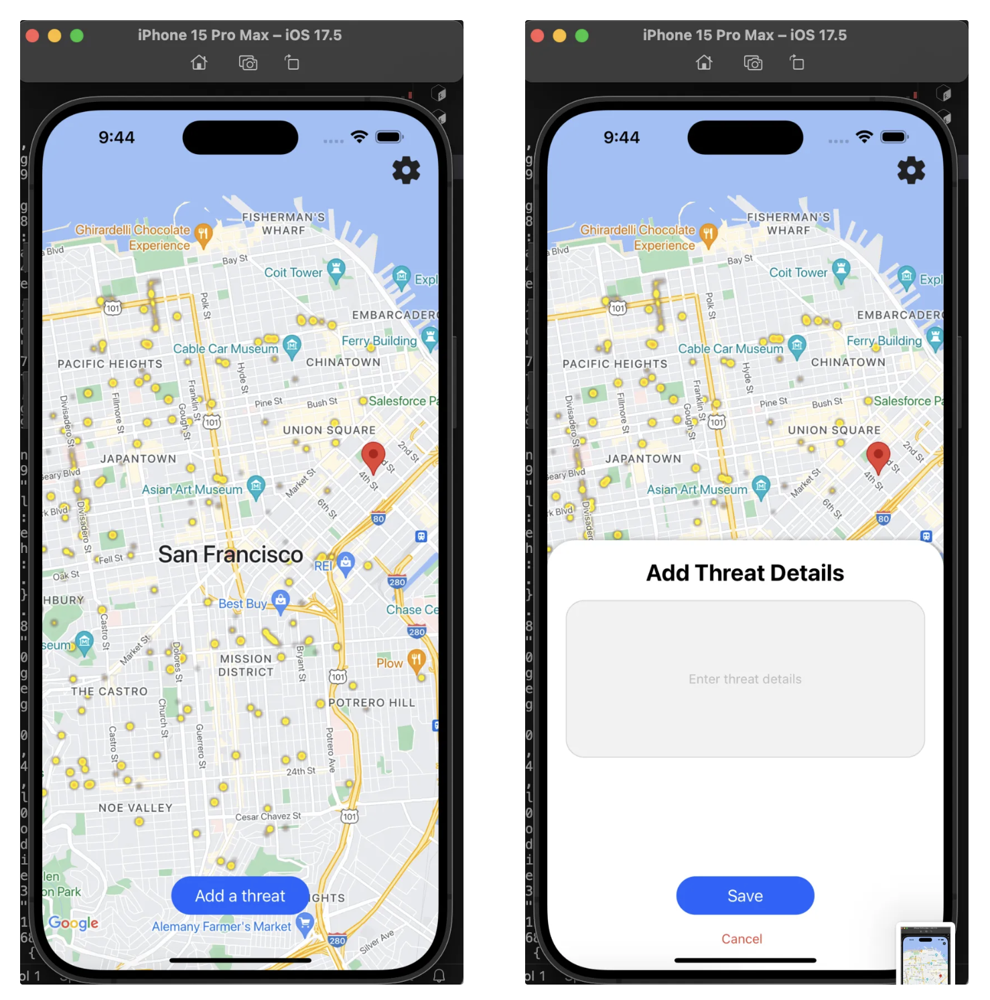
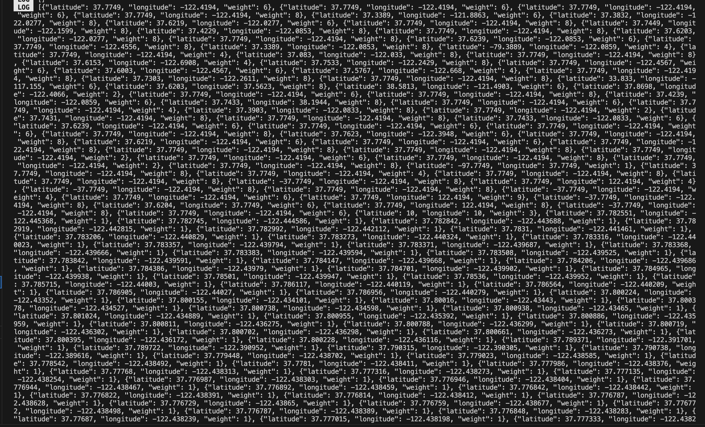

# Threat Tracker

Threat Tracker is an iOS app built with React Native that provides real-time threat intelligence by scraping the web for local news and analyzing data using Hyperbolic Labs' large language model (LLM). The app generates a danger level heat map based on geolocated threat data and allows users to manually input threat information by selecting a location and danger level. Users are notified when danger levels in their vicinity rise.

## Features

- **Real-time Threat Scraping**: Automatically scrapes the web for news articles related to potential threats in your area.
- **AI-driven Analysis**: Uses Hyperbolic Labs' LLM to extract coordinates and assess the danger level of incidents.
- **Danger Level Heat Map**: Displays a heat map that visually represents the current threat level in different areas.
- **User Input for Threats**: Users can contribute by manually adding threats, specifying the location and assigning a danger level.
- **Push Notifications**: Alerts users when there is a significant increase in danger levels around them.
  


## Tech Stack

- **Frontend**: React Native
- **Backend**: MongoDB hosted on Reflex.dev
- **AI Integration**: Hyperbolic Labs LLM for location and danger level processing
- **Hosting**: Reflex.dev

## Reflex Hosted API
- Using FastAPI framework and adapted in Reflex
- Two endpoints connected to the MongoDB

```py
#get request
import requests

url = "https://rxh-prod-api-threattracker.fly.dev/locations"

response = requests.request("GET", url)
```
```py
#post information
import requests

url = "https://rxh-prod-api-threattracker.fly.dev/locations/"

payload = {
    "latitude": 1,
    "longitude": 1,
    "weight": 3,
    "summary": "summary goes here"
}
response = requests.request("POST", url, json=payload)
```



- **LLM usage**: Extracted coordinates using Hyperbolic Labs' LLM from News articles scrabed from web. Also the danger level of incidents were assessed using LLM from the news.

